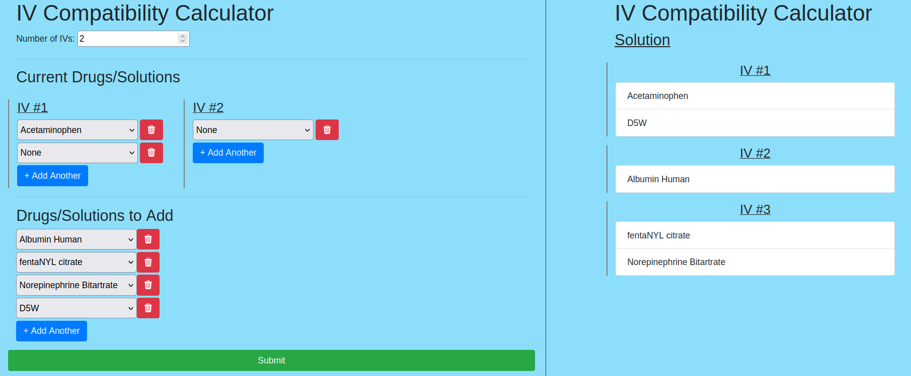

# IV Compatibility Calculator
## DISCLAIMER: NOT FOR MEDICAL USE

This tool was built for demonstration purposes only and should not be used in a real medical setting.

## Overview

When determining which injectible drugs and solutions can be administered together in the same IV,
nurses currently use Y-site compatibility charts like the one below.


These charts can be difficult to read and use, especially when checking the compatibility of more
than two or three drugs.

This tool provides a simple calculator for determining which drugs/solutions should be
grouped together so as to minimize the total number of IVs used.



**NOTE**: Solutions are not guaranteed to be optimal (i.e. the calculator may split the drugs into a larger number of IVs than is actually necessary). Since this problem is NP-complete (graph coloring), a solution is found heuristically.

## Setup
### Database configuration
- Create the database using the schema file `src/schema.sql`: `mysql -u root -p < src/schema.sql`
- Create `conf.d/db.conf` using [conf.d/db.conf.example](conf.d/db.conf.example) as a guide

### Import IV compatibility data
- IV compatibility data can be imported with `cargo run --bin importer /path/to/file.csv`
- The CSV file should have the following format (use [docs/data_example.csv](docs/data_example.csv) as a guide)
  - The first line is the header which is two empty values followed by a list of names of all the drugs/solutions to be imported
  ```
  ,,Acetaminophen,Albumin Human,Amiodarone Hydrochloride
  ```
  - Each following line begins with
    - The name of the drug (this must match the name in the header)
    - `1` if this is an injectable drug or `2` if it is a solution
    - A list of compatibility data for each drug/solution in the header. Data for the drug's compatibility with itself can be elided.
      - Compatibility data is composed of three integers separated by colons `:`. These represent the number of trials in which the drugs were found to be:
        1. Compatible
        2. Incompatible
        3. Mixed results
    ```
    Acetaminophen,1,,0:0:0,0:0:0
    ``` 

### Start the web server
`cargo run --bin iv_compatibility`

The web server runs on port `8080`.